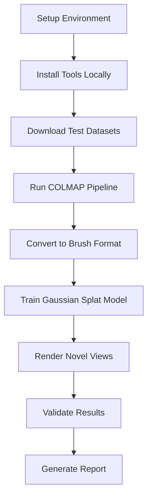

# Implementation Plan for COLMAP and Brush Testing

This document summarizes the comprehensive testing framework we've designed and provides a detailed implementation plan.

## What We've Accomplished

### 1. Testing Framework Architecture ✅
- **Complete directory structure** for organized testing
- **Three-tier dataset approach** (small, medium, challenging)
- **Comprehensive validation framework** with automated quality checks
- **Performance benchmarking system** with detailed metrics
- **Installation automation** for both COLMAP and Brush

### 2. Documentation Complete ✅
- **[`testing/README.md`](testing/README.md)**: Overview and quick start guide
- **[`testing/INSTALLATION_SCRIPTS.md`](testing/INSTALLATION_SCRIPTS.md)**: Detailed installation procedures
- **[`testing/TEST_DATASETS.md`](testing/TEST_DATASETS.md)**: Dataset specifications and benchmarks
- **[`testing/VALIDATION_FRAMEWORK.md`](testing/VALIDATION_FRAMEWORK.md)**: Quality assurance framework

### 3. Pipeline Design ✅


## Implementation Priority

### Phase 1: Core Infrastructure (Next Steps)
**Priority**: High - Required for basic testing

1. **Fix CLI Integration** 
   - Connect `run_tool` in [`tool_manager.rs`](src/core/tool_manager.rs:339) to actual integrations
   - Update [`HylaeanSplat::run_tool`](src/core/mod.rs:117) to route to COLMAP/Brush modules

2. **Create Installation Scripts**
   - `testing/scripts/install_colmap.sh` - Multi-platform COLMAP installation
   - `testing/scripts/install_brush.sh` - Rust-based Brush installation  
   - `testing/scripts/setup_test_env.sh` - Complete environment setup

3. **Basic Test Runner**
   - `testing/scripts/run_full_pipeline.sh` - End-to-end pipeline execution
   - Integration with existing [`colmap.rs`](src/integrations/colmap.rs) and [`brush_app.rs`](src/integrations/brush_app.rs)

### Phase 2: Test Data and Validation (Medium Priority)
**Priority**: Medium - Required for comprehensive testing

1. **Test Dataset Creation**
   - Generate/acquire small synthetic dataset (12 images)
   - Create medium realistic dataset (80 images)
   - Prepare challenging outdoor dataset (150 images)

2. **Validation Scripts**
   - `testing/validation/validate_images.py` - Input quality checks
   - `testing/validation/validate_colmap.py` - COLMAP output validation
   - `testing/validation/validate_brush.py` - Brush training validation

3. **Performance Benchmarking**
   - `testing/validation/benchmark_performance.py` - Resource usage monitoring
   - Quality metrics calculation (PSNR, SSIM, timing)

### Phase 3: Advanced Features (Low Priority)
**Priority**: Low - Nice to have features

1. **Web Dashboard**
   - Real-time progress monitoring
   - Historical performance tracking
   - Visual quality comparisons

2. **CI/CD Integration**
   - GitHub Actions workflow
   - Automated regression testing
   - Performance trend analysis

## Immediate Next Steps

### 1. Fix CLI Integration
**Problem**: Currently, the CLI command `hylaean tool run colmap full_pipeline` doesn't actually execute your COLMAP integration.

**Solution**: Connect the tool manager to your existing integrations:

```rust
// In src/core/tool_manager.rs
pub async fn run_tool(&mut self, name: String, args: Vec<String>) -> Result<()> {
    match name.as_str() {
        "colmap" => {
            let colmap = crate::integrations::colmap::Colmap::new();
            colmap.run_command(&args[0], &args[1..].to_vec())
        }
        "brush_app" => {
            let brush = crate::integrations::brush_app::BrushApp::new();
            brush.run_command(&args[0], &args[1..].to_vec())
        }
        _ => Err(HylaeanError::ToolNotFound { name })
    }
}
```

### 2. Create Basic Test Script
**Goal**: Get a simple test working with your existing integrations

**Test Command Sequence**:
```bash
# Initialize
./target/release/hylaean init

# Install tools locally
./target/release/hylaean tool install colmap --path ./tools
./target/release/hylaean tool install brush_app --path ./tools

# Run pipeline with test images
./target/release/hylaean tool run colmap full_pipeline ./test_images ./output/colmap
./target/release/hylaean tool run brush_app train ./output/colmap ./output/brush_model
./target/release/hylaean tool run brush_app render ./output/brush_model ./output/renders
```

### 3. Test with Real Images
**Simple Test Setup**:
```bash
# Create test directory
mkdir -p test_images

# Add 10-15 images of a simple object
# (photos of a book, mug, or small object from different angles)

# Run the pipeline
./testing/scripts/run_simple_test.sh
```

## File Structure After Implementation

```
testing/
├── README.md                    ✅ Created
├── INSTALLATION_SCRIPTS.md     ✅ Created  
├── TEST_DATASETS.md            ✅ Created
├── VALIDATION_FRAMEWORK.md     ✅ Created
├── IMPLEMENTATION_PLAN.md      ✅ Created
├── scripts/                    🔄 Next: Create actual scripts
│   ├── install_colmap.sh
│   ├── install_brush.sh
│   ├── setup_test_env.sh
│   ├── run_full_pipeline.sh
│   └── download_test_data.sh
├── datasets/                   🔄 Next: Add test data
│   ├── small/
│   ├── medium/
│   └── challenging/
├── validation/                 🔄 Next: Python validation scripts
│   ├── validate_images.py
│   ├── validate_colmap.py
│   ├── validate_brush.py
│   └── benchmark_performance.py
└── outputs/                    🔄 Auto-created during testing
    ├── colmap_results/
    ├── brush_results/
    └── renders/
```

## Expected Testing Workflow

### Quick Test (5 minutes)
```bash
# Setup
./testing/scripts/setup_test_env.sh

# Run with small dataset
./testing/scripts/run_full_pipeline.sh small

# Results in testing/outputs/small/
```

### Full Validation (30 minutes)
```bash
# Test all datasets
./testing/scripts/run_full_pipeline.sh small
./testing/scripts/run_full_pipeline.sh medium
./testing/scripts/run_full_pipeline.sh challenging

# Generate comprehensive report
python3 testing/validation/generate_report.py
```

## Key Implementation Details

### 1. Tool Installation Strategy
- **Local Installation**: Install tools to `./tools/` directory
- **Version Control**: Track tool versions and dependencies
- **Multiple Methods**: Package manager → Conda → Source build → Docker
- **Validation**: Verify installations before use

### 2. Dataset Management
- **Automatic Download**: Scripts to fetch test datasets
- **Quality Validation**: Check images before processing
- **Ground Truth**: Reference data for accuracy validation
- **Scalable**: Easy to add new test scenarios

### 3. Quality Assurance
- **Automated Validation**: No manual intervention required
- **Comprehensive Metrics**: Geometric accuracy, visual quality, performance
- **Regression Testing**: Compare against baseline results
- **Detailed Reporting**: Clear pass/fail with diagnostic information

## Success Criteria

### Minimum Viable Testing
- [ ] CLI can execute COLMAP and Brush integrations
- [ ] Basic installation scripts work
- [ ] Simple test with 10-15 images completes successfully
- [ ] Output validation confirms reconstruction quality

### Full Testing Framework
- [ ] All three dataset sizes process successfully
- [ ] Automated quality validation passes
- [ ] Performance benchmarks meet targets
- [ ] Comprehensive reporting available

### Production Ready
- [ ] CI/CD integration functional
- [ ] Regression testing prevents quality degradation
- [ ] Documentation complete and user-friendly
- [ ] Error handling robust and informative

## Recommended Next Action

**Switch to Code Mode** to implement the critical infrastructure:

1. **Fix CLI Integration**: Connect tool manager to existing integrations
2. **Create Installation Scripts**: Automate COLMAP and Brush setup
3. **Build Simple Test**: Get basic pipeline working with test images
4. **Validate Results**: Confirm reconstruction quality

This will enable you to test your COLMAP and Brush integrations with a folder of images using the `hylaean` CLI tool as intended.

The comprehensive framework we've designed will ensure robust, automated testing across multiple scenarios while providing detailed quality metrics and performance benchmarks.